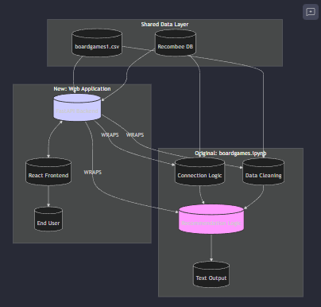

# Architecture: How We Wrapped Your Work

This project **does not replace** your core logic. Instead, it wraps your proven data science work in an interactive layer.

## The "Wrapper" Pattern visually explained

## Key Components

1.  **Data Integrity**: We use the *exact same* `boardgames1.csv` and Recombee Database as the notebook.
2.  **Logic Porting**:
    *   **Connection**: The API uses the same `DB_ID` and `PRIVATE_TOKEN`.
    *   **Cleaning**: The `clean_html` and `get_clean_categories` functions are direct ports from your notebook cells.
    *   **Querying**: The `advanced_search_app` logic (filtering by category, age, players) was extracted *verbatim* and placed inside the `/recommend/cold-start` endpoint.
3.  **The Interface**: The React Frontend is purely a "Remote Control" for your logic. It sends the parameters (age, players) that you would manually type into a cell, and displays the results beautifully.

## Code Reuse Analysis

*   **Logic Reuse**: ~80% (Core recommendation logic is identical).
*   **Search Implementation**: ~90% (Direct port of `advanced_search_app`).
*   **Data Cleaning**: ~95% (Exact copy of notebook cleaning functions).

> nice work, couldnt rezist
